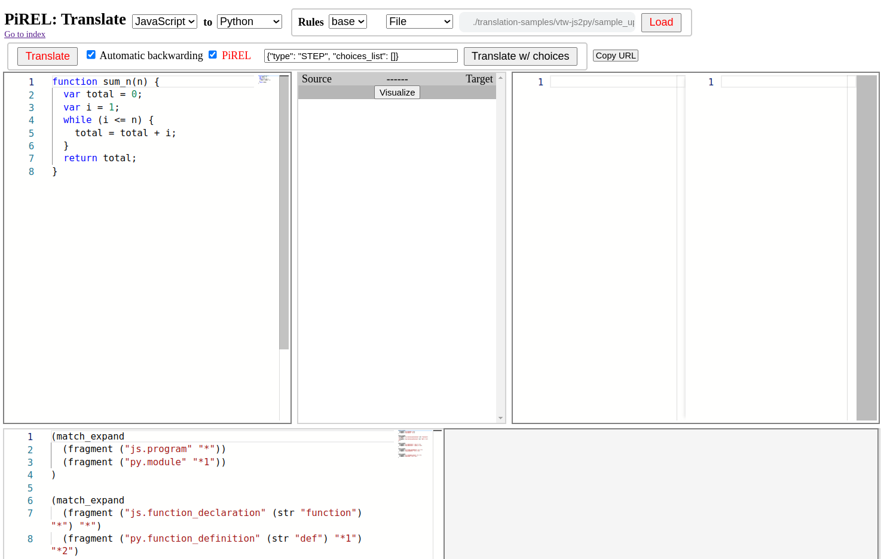
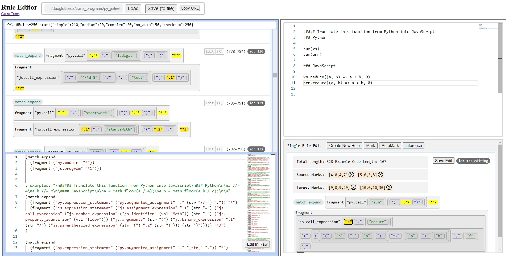
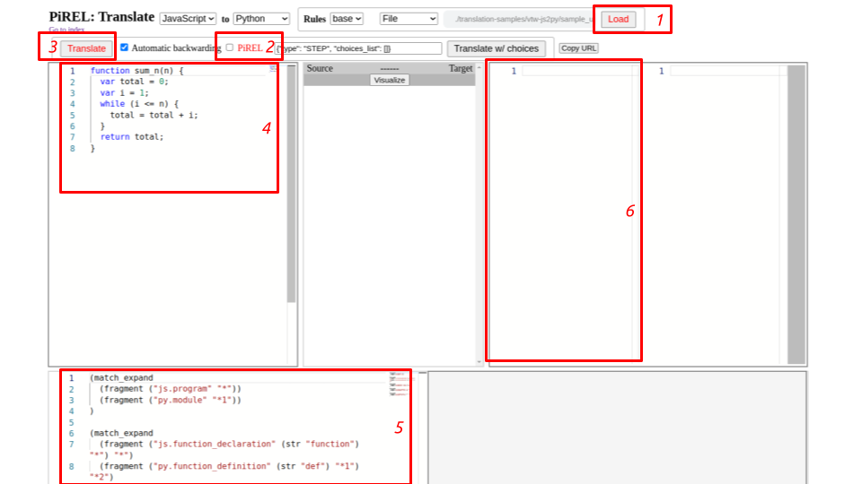

# PiREL: Transpilation via Rule Extraction from an LLM

## License
Main part of the code is under MIT License.
Some dependencies and datasets are under other licenses. See [DEPENDENCY.md](./DEPENDENCY.md) for details.

## Introduction
This is an ongoing research work.

## Installation
### **Step 1: Check basic requirements**
- `x64` architecture (due to compiled cython modules)
- `Docker` with the `docker-compose-plugin` (`Docker 20.10+` recommended. Lower versions are not tested)
- `Linux` (For the starting bash scripts. It is expected to work on any Linux distributions, although tested only on `Ubuntu 18.04`, `20.04`, and `22.04`)

### **Step 2: Build and run the development container**
Run the command `./main-dev-cli.sh` to automatically build and start the development container. You should enter the container's CLI (`node ➜ /workspace (main ✗) $ `) after this command.

```
$ ./main-dev-cli.sh 
Sending build context to Docker daemon  5.632kB
Step 1/8 : FROM ...
Step 2/8 : RUN apt-get update && export ...
...
Successfully built 412a5e32b87a
Successfully tagged devprojbase:latest
devprojbase-container
node ➜ /workspace (main ✗) $ 
```

### **Step 3: Build all the docker images for evaluating `DuoGlot`**

Run the command `sudo ./main-dev-install.sh` **inside the development container**.

You should be able to see output like this:
```
node ➜ /workspace (main ✗) $ sudo ./main-dev-install.sh 
========= installing frontend dependencies (node_modules) =========
--------- install monaco ---------
...
+ monaco-editor@0.31.1
updated 1 package and audited 1 package in 3.504s
found 0 vulnerabilities

========= build docker images (using host docker) =========
--------- build docker images: thirdparty ---------
Sending build context to Docker daemon  3.434MB
Step 1/21 : FROM continuumio/anaconda3
...
Successfully built 02a2f6e1c11a
Successfully tagged thirdp-duoglotcompare:latest

--------- build docker images: backendpybase ---------
Sending build context to Docker daemon  6.656kB
Step 1/6 : FROM python:3.9.13
...
Successfully built 8ecf0b5a1a25
Successfully tagged backendpybase:latest

--------- build docker images: backendtestingbase ---------
Sending build context to Docker daemon   7.68kB
Step 1/16 : FROM ubuntu:22.04
...
Successfully built a42d298f47c5
Successfully tagged backendtestingbase:latest

--------- build docker images: nginxbase ---------
Sending build context to Docker daemon  3.584kB
Step 1/2 : FROM nginx:1.21.6
...
Successfully built 4b7c97765cf1
Successfully tagged nginxbase:latest
node ➜ /workspace (main ✗) $ 
```

Then exit the development container. On the host system, run `docker image ls` at least the following 5 images should apear.
```
$ docker image ls
REPOSITORY             TAG       IMAGE ID       CREATED         SIZE
thirdp-duoglotcompare  latest    f6fb6f46da95   19 hours ago    5.45GB
nginxbase              latest    2c8d630f2bf5   2 days ago      163MB
backendtestingbase     latest    c2b2e13846ea   2 days ago      1.14GB
backendpybase          latest    b959be4717ba   2 days ago      1.07GB
devprojbase            latest    284e96d5a21b   2 days ago      1.49GB
```

### **Step 4: Starting PiREL Services**

Run the command `./main-host-start.sh` **on the host system (outside of the development container)**.

You should be able to see all containers up. On a separate shell, run `docker ps` to check if they are all running normally:

```
$ docker ps
CONTAINER ID IMAGE                  COMMAND               ... PORTS ...
9a582a6e411d thirdp-duoglotcompare  "/bin/bash"           ...                       
8fc8cb9205e0 backendpybase          "python server_files…"...                       
7a522e4640f5 backendpybase          "python server_trans…"...                       
0e5fe51d562c backendtestingbase     "python3 server_test…"...                       
6c77347bdf9c nginxbase              "/docker-entrypoint.…"... 127.0.0.1:8000->80/tcp ...
```

Notice that the `PiREL` is exposed at `127.0.0.1:8000`. Open the browser to visit different tools at different URLs:


- Link to the Translation UI:  
  http://127.0.0.1:8000/frontend/duoglot/pirel/ui_translate_single.html
  
- Rule Editor UI:  
  http://127.0.0.1:8000/frontend/duoglot/index_editrule.html
  
- Index:
  http://127.0.0.1:8000/frontend/duoglot/index.html

If you can successfully load those pages, then it's good to go.


## Use Case

### **Translate JavaScript code to Python code**
1. After obtaining a JavaScript code using [BlocklyCode](https://github.com/vtw-developers/dna-blockly-open), save it for reference.
2. Visit [PiREL Translation UI](http://127.0.0.1:8000/frontend/duoglot/pirel/ui_translate_single.html)
   
3. After setting up translation source and target languages, starting ruleset, and the program you want to translate, click on the Load button (1).
4. The program can be edited in the text field on the left (4), and the ruleset can be edited in the text field at the bottom (5).
5. Check the PiREL checkbox (2).
6. Click on the Translate button (3).
7. If translation runs successfully, the target program will appear in the text field (6).
